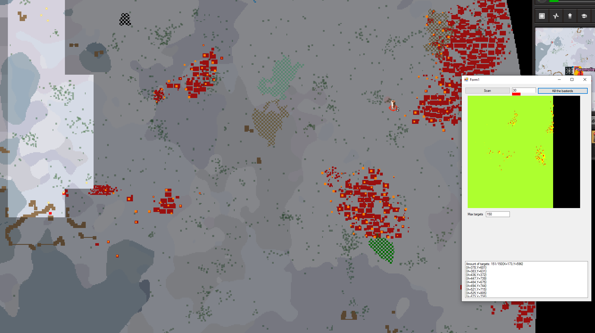

# Factorio artillery clicky

Small tool that scans for red pixels in the fog on your main screen, marks them as targets, and shoots them with a delay to prevent the targets to expire.
If something messes up and it starts missing, press `ctrl` and it will abort whatever it's doing.

- Open the map and look at any red pixels that you want to shoot (zoom in if needed to not see out of range ones)
- Configure red-box-size (defaults to 50 == zoomed in a lot)
- Click scan, tweek red-box-size and re-scan if needed
- Select the `Targeting remote` from your inventory
- Pull the lever cronk
- When its going wrong, press `ctrl` to abort moving your mouse

## Examples

Newer version

Older version

